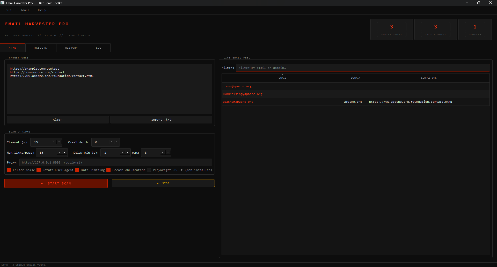

# 🔴 Email Harvester Pro

A Red Team OSINT tool to extract **publicly available email addresses** from websites using regex, crawling, and filtering.

---

## 🚀 Features

- 🔍 Email extraction using regex  
- 🌐 Multi-URL scanning  
- 🕷 Internal link crawling  
- 🎭 User-Agent rotation  
- ⏱ Rate limiting (stealth mode)  
- 🧠 Email de-obfuscation  
- 📊 Live GUI dashboard (PyQt6)  
- 💾 Export (CSV / JSON / TXT)  
- 🗃 Scan history with SQLite  

---

## ⚙️ Installation

```bash
pip install -r requirements.txt
pip install playwright
python -m playwright install chromium
```

> ⚠️ If `playwright` command fails, use:
> ```bash
> python -m playwright install chromium
> ```

---

## ▶️ Usage

```bash
python email_extractor_gui.py
```

### Steps

1. Enter target URLs  
2. Set crawl depth (recommended: 1)  
3. Click **START SCAN**  
4. View results  
5. Export emails  

---

## 🧪 Example Targets

```text
https://example.com/contact
https://opensource.com/contact
https://www.apache.org/foundation/contact.html
```

---

## 📊 Sample Extracted Emails

*(Example output from real-world scans)*

```text
security@apache.org
press@apache.org
webmaster@example.com
info@opensource.com
contact@example.com
```

> Note: Results vary depending on website structure and availability.

---

## 📸 Screenshot



---

## ⚠️ Disclaimer

This tool is for **educational and authorized security testing only**.  
Only use it on websites you own or have permission to test.

---

## ⬇️ Download

👉 [Download Latest Release](https://github.com/akshatcore/email-harvester-pro/releases/latest)

Includes:
- Windows executable (.exe)
- Portable version

---

## 👨‍💻 Author

**Akshat Tiwari**
